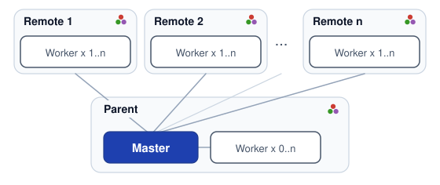

# DistSSHKit.jl

[English](README.md) · [日本語](README.ja.md)

[](https://github.com/yamanori99/DistSSHKit.jl/actions/workflows/CI.yml)
[](https://codecov.io/gh/yamanori99/DistSSHKit.jl)
[](https://github.com/yamanori99/DistSSHKit.jl/actions/workflows/aqua.yml)
[](https://github.com/yamanori99/DistSSHKit.jl/actions/workflows/jetls.yml)
[](https://github.com/yamanori99/DistSSHKit.jl/actions/workflows/ssh-e2e.yml)

[](https://github.com/yamanori99/DistSSHKit.jl/actions/workflows/ssh-e2e-weekly.yml)
[](https://github.com/yamanori99/DistSSHKit.jl/actions/workflows/ci-weekly.yml)

[](https://yamanori99.github.io/DistSSHKit.jl/stable/)
[](https://yamanori99.github.io/DistSSHKit.jl/dev/)
[](https://yamanori99.github.io/DistSSHKit.jl/stable/requirements/)

[](LICENSE)
[](https://github.com/yamanori99/DistSSHKit.jl/discussions)

DistSSHKit は、ローカルと SSH 先で同じ Julia プロジェクトを走らせ、結果を集めるキットである。
SSH 分散実行の手順を簡単にし、揃えることで、再現しやすい実行を助ける。
スレッドではなく Distributed.jl のプロセスを使う。
対応は **macOS、Linux、WSL2 Ubuntu** (ネイティブ Windows は対象外)。

小さな研究室や個人でも、高性能なマシンやワークステーションを何台か持っていることがある。
DistSSHKit は、それらをまとめて小さな計算ノードとして使うためのものである。
関連して、共有マシンでジョブを順番に走らせる [DistSSHQueue.jl](https://github.com/yamanori99/DistSSHQueue.jl) は General にある (`pkg> add DistSSHQueue`)。実行は DistSSHKit が担う。

## インストール

Julia REPL で `]` を押して Pkg モードに入り、次を実行する。

```julia
pkg> add DistSSHKit
```

同じことを `Pkg` API で書くと次のとおり。

```julia
julia> import Pkg; Pkg.add("DistSSHKit")
```

キットを動かすマシンには **`ssh`**、**`rsync`**、および (git デプロイを使うときだけ) **`git`** も必要。
`pkg> add` では入らない。詳細な利用条件については以下:
[Requirements](https://yamanori99.github.io/DistSSHKit.jl/stable/requirements/)。

パッケージの詳細は **[ドキュメント](https://yamanori99.github.io/DistSSHKit.jl/stable/)** を参照。

## 使用方法

### 基本用語

- **ホスト** — 計算するマシン。ここでは、`parent` や `child:user@hostname` のようにトークンで指定する。
- **プロセス** — 起動した `julia` 1つ分のこと。それぞれ独立したメモリを持ち、OS 上で別々に動く。
  (このキットは1台のマシンでも複数の `julia` プロセスを起動して並列に走らせる。Distributed.jl ベース)
- **マスター** — キット起動側のプロセス。`go` ではスロットを計画し、`drive` では仕事をワーカーに渡して結果を集める。キット起動側は、そのプロセスを起動したマシンである。
- **ワーカー** — マスターから仕事を受け取って実行するプロセス。

例: 手元で `go` / `drive` を実行する場合、そのマシンがキット起動側になる。
ワーカーは1マシンに複数立てられ (起動側はゼロでもよい)、リモートマシンは何台でも増やせる。

<!-- markdownlint-disable MD033 -->
<p align="center">
  <picture>
    <source media="(prefers-color-scheme: dark)" srcset="docs/src/assets/diagram/topology-dark.svg">
    
  </picture>
</p>
<!-- markdownlint-enable MD033 -->

図は **drive** である。キット起動側にマスターが1つ、各ホストにワーカーがいる。
**go** でもホストのトークン指定は同じだが、マスター/ワーカーではなく、各ホストが独立してスクリプトを実行する。

```text
parent                 # キット起動側
parent:2               # キット起動側で2つのワーカー
child:user@hostname    # SSH 先 (user@host / IP / Host エイリアス)
child:user@hostname:4  # SSH 先で4つのワーカー
```

SSH 先の台数に上限はない。台数を増やすほど SSH 接続や配置にかかる時間は伸びるので、まずは数台で試すのが無難である。

使う前に、各 SSH 先で次を満たす必要がある。

- キット起動側からパスワードなしで SSH ログインできること
- Julia がインストールされていて、キット起動側と **メジャー.マイナーバージョンが一致**していること
  (`setup --check` で確認できる)

詳細: [Requirements](https://yamanori99.github.io/DistSSHKit.jl/stable/requirements/)。

> [!TIP]
> SSH 切断が心配なら、常時起動のマシンを使い、マスター側は `tmux` などでセッションを残す。

### go と drive

スクリプトの実行方法には2種類ある。

- **go** — 各ホストが、そのままの `.jl` を最初から最後まで実行する
- **drive** — 1つのマスターがワーカーに仕事を振る (Distributed.jl ベース)

go 単体も十分有用だが、まず go で単独実行を確認してから、
drive / Distributed.jl 対応へ進む段階的な開発ができる。

### 操作方法

- **CLI** — ターミナルから直接コマンドとして叩く方法。
  例: `julia --project=. -m DistSSHKit go child:user@host1:1 script.jl`。
  すぐ試したいときや、シェルスクリプトに組み込みたいときに向く
- **Julia** — 自分の Julia コード (スクリプトや REPL、他パッケージ) の中から関数として呼ぶ方法。
  `setup!`、`go!` / `drive!` などの `!` 付き関数を使う
- **`distsshkit` (実験的)** — `pkg> app add DistSSHKit` のあと、ターミナルの `distsshkit` コマンド。
  フラグは `-m` と同じだが、常に Apps 側のコピーを使う (`--project=.` ではない)。
  `go` / `setup` / `demo` は `distsshkit` でよいが、`drive` と `size` は
  `julia --project=. -m DistSSHKit` を使う。
  使い分け: [User Guide](https://yamanori99.github.io/DistSSHKit.jl/stable/manual/distsshkit/)

CLI の `setup --rsync` は `setup!(session, :rsync)` に対応する、というように
CLI のオプションと Julia API は1対1である。
実例は [`demos/with_kit/pipeline_square.jl`](demos/with_kit/pipeline_square.jl) や
[`demos/without_kit/pipeline_pi.jl`](demos/without_kit/pipeline_pi.jl) を参照。

どちらも中身は同じで、呼び方が違うだけである。まずは CLI から試すのがわかりやすい。

### 下準備

ふつうはスクリプトの前に `setup` で配置と依存を揃える。
1回の呼び出しにつき、配置・初期化などの動作は基本1つだけ指定する。
空または未作成のリモートなら `go --rsync` / `drive --rsync` でコピーと instantiate を一度にできる
(既定の `go` / `drive` は、リモートが既に用意されていることを前提とする)。

- 初回配置: `--rsync` (ローカルのツリーをそのまま送る) か `--clone` (git リポジトリを clone) のどちらか一方
- 依存の用意: `--instantiate` (リモートで `Pkg.instantiate`)
- 更新 (再配置): `--sync` (git push → 各リモートで pull)、`--pull` (push せず pull だけ)、または再度 `--rsync`
- その他
  - `--check` (SSH / Julia / 依存関係の疎通確認)
  - `--cleanup` (残っているワーカープロセスの掃除)
  - `--delete` (リモートのプロジェクトディレクトリを削除。破壊的操作)

`--rsync` / `--clone` / `--sync` / `--pull` / `--delete` は実行前に確認する。
スクリプトなどで非対話に実行したい場合は `-y` / `--yes` を付ける。

詳細: [setup](https://yamanori99.github.io/DistSSHKit.jl/stable/manual/setup/)。

> [!NOTE]
> **rsync か git か迷ったら**
>
> - **`--rsync`** — ローカルのファイルをそのまま送るだけ。リモートに git は不要。まず試す・単発で使うならこちら
> - **`--clone` → `--sync`** — git リポジトリとして管理する。継続的にコードを更新しながら使う場合や、
>   `drive --require-git` でリモートの commit をローカルと一致させて確認したい場合はこちら

よくある初回セットアップの流れは次のとおり (rsync の場合):

```bash
# ファイル転送
julia --project=. -m DistSSHKit setup --rsync user@host1 user@host2
# 依存の用意
julia --project=. -m DistSSHKit setup --instantiate user@host1 user@host2
# 疎通確認
julia --project=. -m DistSSHKit setup --check user@host1 user@host2
```

その他、困ったときによく使うコマンド:

```bash
# 残っている古いワーカープロセスを掃除する
julia --project=. -m DistSSHKit setup --cleanup user@host1 user@host2
# 全部やり直したいとき (実行確認あり)
julia --project=. -m DistSSHKit setup --delete user@host1 user@host2
```

### 実行例

下準備のあと、次のように実行する。

**CLI で go する例。** 各ホストで `script.jl` を1本ずつ実行する (`parent:N` も指定可)。

```bash
julia --project=. -m DistSSHKit go child:user@host1:1 child:user@host2:1 path/to/script.jl
```

**CLI で drive する例。** git デプロイなら、あとからの更新は `setup --sync`。`rsync` でもよい。

```bash
julia --project=. -m DistSSHKit drive parent:2 child:user@host1:4 path/to/driver.jl
```

**Julia コードで go する例。** `remote=` は `setup!` と揃える (どちらも省略すれば既定パス)。

```julia
using DistSSHKit

remote = "/path/to/project"
session = KitSession(workers=["child:user@host1"], remote=remote, yes=true)
setup!(session, :rsync, :instantiate)
go!("path/to/script.jl", "child:user@host1:1"; remote=remote)
```

**Julia コードで drive する例。**

```julia
using DistSSHKit

remote = "/path/to/project"
session = KitSession(workers=["child:user@host1"], remote=remote, yes=true)
setup!(session, :clone; repo="https://github.com/org/proj.git")
setup!(session, :instantiate)
drive!("path/to/driver.jl", "parent:2", "child:user@host1:4"; remote=remote)
setup!(session, :sync)  # 2回目以降の更新
```

`pipeline!` は任意のまとめ呼びである。sync → `size!` → `drive!` → collect を一度にできる。
`setup!` は含まない。`sync=:rsync` はコピーのみ (instantiate しない)。
リモートは先に用意するか、`drive!(…; sync=:rsync)` を使う。
詳細: [API](https://yamanori99.github.io/DistSSHKit.jl/stable/api/)。

### デモを試す

スクリプトを自分で書く前にキットを試すことができる。
`with_kit` は drive、`without_kit` は単独実行 / go:

```bash
julia --project=. -m DistSSHKit demo install with_kit
julia --project=. -m DistSSHKit demo install without_kit
```

```bash
julia --project=. -m DistSSHKit drive parent:2 demos/with_kit/square_file.jl
julia --project=. -m DistSSHKit go parent:2 demos/without_kit/pi_file.jl
```

詳細: [Demo](https://yamanori99.github.io/DistSSHKit.jl/stable/tutorial/demo/)。

## ドキュメント

公式ドキュメント本体は英語である。

|              |                                                                                |
| ------------ | ------------------------------------------------------------------------------ |
| Introduction | [Introduction](https://yamanori99.github.io/DistSSHKit.jl/stable/)             |
| First Steps  | [First Steps](https://yamanori99.github.io/DistSSHKit.jl/stable/requirements/) |
| User Guide   | [User Guide](https://yamanori99.github.io/DistSSHKit.jl/stable/manual/)        |
| API          | [API](https://yamanori99.github.io/DistSSHKit.jl/stable/api/)                  |
| News         | [NEWS.md](NEWS.md)                                                             |

## 貢献

バグ報告・機能要望は [Issues](https://github.com/yamanori99/DistSSHKit.jl/issues)。
質問やアイデアは [Discussions](https://github.com/yamanori99/DistSSHKit.jl/discussions)。
貢献の仕方は [CONTRIBUTING.md](CONTRIBUTING.md) を参照。

## ライセンス

ソースコードは [MIT](LICENSE)。ロゴと図に含まれる Julia ドットは
Copyright (c) 2012-2022 Stefan Karpinski、
[CC BY-NC-SA 4.0](https://creativecommons.org/licenses/by-nc-sa/4.0/)。
DistSSHKit はそれを改変して使っている。
詳細は [LICENSE](LICENSE) と
[julia-logo-graphics](https://github.com/JuliaLang/julia-logo-graphics)。

<!-- markdownlint-disable MD033 -->
<p align="center">
  
  
</p>
<!-- markdownlint-enable MD033 -->
