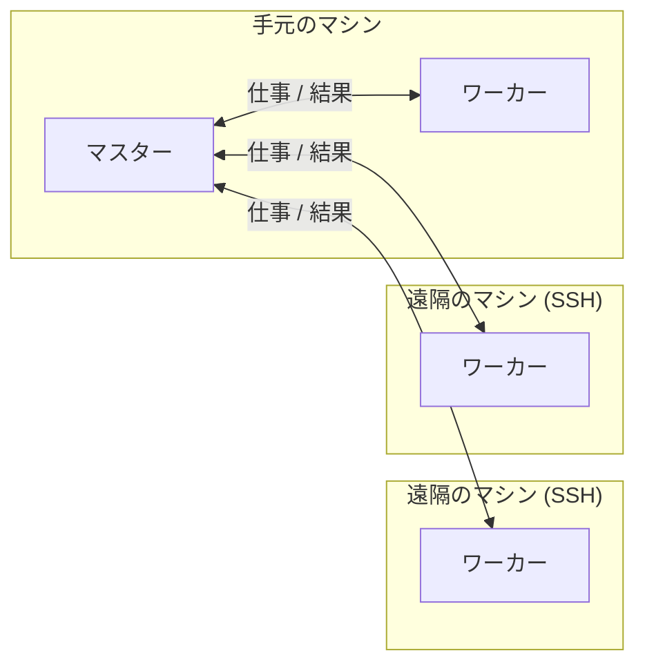

# DistSSHKit.jl

[English](README.md) | [日本語](README.ja.md)

[CI](https://github.com/yamanori99/DistSSHKit.jl/actions/workflows/CI.yml)
[codecov](https://codecov.io/gh/yamanori99/DistSSHKit.jl)
[JETLS](https://github.com/yamanori99/DistSSHKit.jl/actions/workflows/jetls.yml)
[E2E daily](https://github.com/yamanori99/DistSSHKit.jl/actions/workflows/ssh-e2e-daily.yml)
[Aqua](https://github.com/yamanori99/DistSSHKit.jl/actions/workflows/aqua.yml)

[Stable](https://yamanori99.github.io/DistSSHKit.jl/stable/)
[Dev](https://yamanori99.github.io/DistSSHKit.jl/dev/)
[Julia 1.12+](https://yamanori99.github.io/DistSSHKit.jl/stable/requirements/)

[License: MIT](LICENSE)
[Discussions](https://github.com/yamanori99/DistSSHKit.jl/discussions)

DistSSHKit は、1つの Julia プロジェクトを手元と SSH 先で走らせ、結果を集めるためのキット。
複数マシンへの SSH 分散実行のやり方をより簡単に、さらに標準化することで、
ユーザーのプロジェクトの再現性を助ける。スレッドではなく Distributed.jl のプロセスを使う。
対応は **macOS、Linux、WSL2 Ubuntu** (ネイティブの Windows は対象外)。

小さな研究室や個人でも、高性能マシンやワークステーションを何台か所持していることがある。
DistSSHKit は、それらハードウェアを効率的に利用し、小規模な計算ノードの設置を助ける。
(関連して、簡易的なスケジューラを開発中である: `DistSSHKitQueue.jl`)。

**0.3** では、現在大きな機能変更はしない。いまの使い方のまましばらく使用できる。通常のバグ修正は続ける。
[CONTRIBUTING.md](CONTRIBUTING.md#feature-freeze) /
[Discussion #26](https://github.com/yamanori99/DistSSHKit.jl/discussions/26)。

## インストール

Julia REPL で `]` を押して Pkg モードに入り、次を実行する。

```julia
pkg> add DistSSHKit
```

同じことを `Pkg` API で書くと次のとおり。

```julia
julia> import Pkg; Pkg.add("DistSSHKit")
```

キットを動かすマシンには `**ssh**`、`**rsync**`、および (git デプロイを使用する場合のみ) `**git**` も必要。
`pkg> add` では入らない。詳細な利用条件については以下:
[Requirements](https://yamanori99.github.io/DistSSHKit.jl/stable/requirements/)。

パッケージの詳細は **[ドキュメント](https://yamanori99.github.io/DistSSHKit.jl/stable/)** を参照。

## 使用方法

### 基本用語

- **ホスト** — 計算するマシン。手元なら `local`、SSH 先なら `user@host` のように書く
   (`host` は `user@hostname`、IP アドレス、または SSH config の `Host` エイリアスのいずれか)
- **プロセス** — 起動した `julia` 1つ分のこと。それぞれ独立したメモリを持ち、OS 上で別々に動く
   (このキットは1台のマシンでも複数の `julia` プロセスを起動して並列に走らせる。Distributed.jl ベース)
- **マスター** — 並列処理全体を指揮するプロセス。仕事を分けてワーカーに渡し、結果を集める側
- **ワーカー** — マスターから仕事を受け取って実行するプロセスである。

例: 手元のマシンと、遠隔のマシン2台を使う場合。



リモートホストの台数に上限はない。台数を増やすほど SSH 接続や配置にかかる時間は伸びるので、まずは数台で試すのが無難である。

使う前に、各リモートホストで次を満たしておく必要がある。

- 手元のマシンからパスワードなしで SSH ログインできること
- Julia がインストールされていて、手元のマシンと **メジャー.マイナーバージョンが一致**していること
  (`setup --check` で確認できる, 後述)

詳細: [Requirements](https://yamanori99.github.io/DistSSHKit.jl/stable/requirements/)。

> [!TIP]
> SSH 切断のリスクがある場合は、どのマシンも据え置きのものを使い、
> マスターになるマシンは `tmux` などで実行を継続させるとよい。

### go と drive

スクリプトの実行方法には2種類ある。

- **go** — 各ホスト / マシンがユーザーのスタンドアロンの `.jl` ファイルを最初から最後まで実行する
- **drive** — 1つのマスターがワーカーに仕事を振る (Distributed.jlベース)

go 単体も十分有用だが、まず go でスタンドアロンな実行を確認してから、
drive / Distributed.jl 対応へ進む段階的な開発ができる。

### 操作方法

- **CLI** — ターミナルから直接コマンドとして叩く方法。
  例: `julia -m DistSSHKit go user@host1:1 script.jl`。
  すぐ試したいときや、シェルスクリプトに組み込みたいときに向く
- **Julia** — 自分の Julia コード (スクリプトや REPL、他パッケージ) の中から関数として呼ぶ方法。
  `setup!`、`go!` / `drive!` などの「`!` 付き関数」を使う。
  
CLI の `setup --rsync` は `setup!(session, :rsync)` に対応する、
というように CLI のオプションと1対1で対応している。
実例は [`demos/with_kit/pipeline_square.jl`](demos/with_kit/pipeline_square.jl) や
[`demos/without_kit/pipeline_pi.jl`](demos/without_kit/pipeline_pi.jl) を参照

どちらも中身は同じで、呼び方が違うだけ。まずは CLI から試すのがわかりやすい。

## 下準備

スクリプトを実行する前に必ずセットアップする必要がある。
きっとの `setup` を用いて、リモートホストへ手元のJuliaプロジェクトを配置し、初期化・起動する操作を行う。

- 初回配置: `--rsync` (手元のツリーをそのまま送る) か `--clone` (git リポジトリを clone) のどちらか一方
- 初期化: `--instantiate` (`Pkg.instantiate` をリモートで実行し、依存パッケージを揃える)
- 更新 (再配置): `--sync` (git push → 各リモートで pull) または再度 `--rsync`
- その他
  - `--check` (SSH / Julia / 依存関係の疎通確認)
  - `--cleanup` (残っているワーカープロセスの掃除)
  - `--delete` (リモートのプロジェクトディレクトリを削除。破壊的操作)

`--rsync` / `--clone` / `--sync` / `--pull` / `--delete` は実行前に確認する。
スクリプトなどで非対話に実行したい場合は `-y` / `--yes` を付ける。

詳細: [setup](https://yamanori99.github.io/DistSSHKit.jl/stable/manual/setup/)。

> [!NOTE]
> **rsync か git か迷ったら**
>
> - **`--rsync`** — 手元のファイルをそのまま送るだけ。リモートに git は不要。まず試す・単発で使うならこちら
> - **`--clone` → `--sync`** — git リポジトリとして管理する。継続的にコードを更新しながら使う場合や、
>   `drive --require-git` でリモートの commit を手元と一致させて確認したい場合はこちら

よくある初回セットアップの流れは次のとおり (rsync の場合):

```bash
# ファイル転送
julia --project=. -m DistSSHKit setup --rsync user@host1 user@host2
# 初期化       
julia --project=. -m DistSSHKit setup --instantiate user@host1 user@host2
# 疎通確認
julia --project=. -m DistSSHKit setup --check user@host1 user@host2
```

その他、困ったときによく使うコマンド:

```bash
# 残っている古いワーカープロセスを掃除する
julia --project=. -m DistSSHKit setup --cleanup user@host1 user@host2
# 全部やり直したいとき (実行確認あり)
julia --project=. -m DistSSHKit setup --delete user@host1 user@host2
```

## 実行例

**CLI で go する例。** ファイルを rsync でリモートにコピーし (初回のみ)、各マシンでJuliaを起動し (`--instantiate`)、
`user@host1` と `user@host2` それぞれで `script.jl` を1本ずつ実行する。
(1回の呼び出しにつき `setup` のモードは1つだけ指定する)

```bash
julia --project=. -m DistSSHKit setup --rsync user@host1        # ファイルを転送 (初回のみ)
julia --project=. -m DistSSHKit setup --instantiate user@host1  # 初期化
# 指定した各ホストで script.jl を1つずつ実行する (local:N も指定可)
julia --project=. -m DistSSHKit go user@host1:1 user@host2:1 path/to/script.jl
```

**CLI で drive する例。** git 経由でリモートにデプロイ (コピー) する場合は、初回だけ `--clone`、
2回目以降は `--sync` で更新する。上述のような `rsync` も利用できる。

```bash
julia --project=. -m DistSSHKit setup --clone user@host1        # リポジトリを clone (初回のみ)
julia --project=. -m DistSSHKit setup --instantiate user@host1  # 初期化
julia --project=. -m DistSSHKit drive local:2 user@host1:4 path/to/driver.jl
julia --project=. -m DistSSHKit setup --sync user@host1         # 2回目以降の更新
```

**Julia コードで go する例。** 上の CLI 例と同じことを、Julia のコードから行う。
`remote=` は `setup!` の呼び出しと揃えること(どちらも省略すれば既定のパスが使われる)。

```julia
using DistSSHKit

remote = "/path/to/project"
session = KitSession(workers=["user@host1"], remote=remote, yes=true)
setup!(session, :rsync, :instantiate)                   # ファイル転送 + 依存パッケージ準備
go!("path/to/script.jl", "user@host1:1"; remote=remote)  # 実行
```

**Julia コードで drive する例。**

```julia
using DistSSHKit

remote = "/path/to/project"
session = KitSession(workers=["user@host1"], remote=remote, yes=true)
setup!(session, :clone; repo="https://github.com/org/proj.git")  # clone (初回のみ)
setup!(session, :instantiate)                                    # 依存パッケージ準備
drive!("path/to/driver.jl", "local:2", "user@host1:4"; remote=remote)  # 実行
setup!(session, :sync)                                           # 2回目以降の更新
```

`pipeline!` は任意の糖衣である。任意の sync → `size!` → `drive!` → 任意の collect。
`setup!` は走らない。リモートは先に用意しておく必要がある。
詳細: [API](https://yamanori99.github.io/DistSSHKit.jl/stable/api/)。

### デモを試す

スクリプトを自分で書く前にキットを試すことができる。

```bash
julia --project=. -m DistSSHKit demo install with_kit
```

```bash
julia --project=. -m DistSSHKit drive local:2 demos/with_kit/square_file.jl
```

詳細: [Demo](https://yamanori99.github.io/DistSSHKit.jl/stable/tutorial/demo/)。

## ドキュメント

(日本語未対応)

|              |                                                                                |
| ------------ | ------------------------------------------------------------------------------ |
| Introduction | [Introduction](https://yamanori99.github.io/DistSSHKit.jl/stable/)             |
| First Steps  | [First Steps](https://yamanori99.github.io/DistSSHKit.jl/stable/requirements/) |
| User Guide   | [User Guide](https://yamanori99.github.io/DistSSHKit.jl/stable/manual/)        |
| API          | [API](https://yamanori99.github.io/DistSSHKit.jl/stable/api/)                  |
| News         | [NEWS.md](NEWS.md)                                                             |

## 貢献

バグ報告・機能要望は [Issues](https://github.com/yamanori99/DistSSHKit.jl/issues)。
質問やアイデアなどの雑談は [Discussions](https://github.com/yamanori99/DistSSHKit.jl/discussions)。
貢献の仕方は [CONTRIBUTING.md](CONTRIBUTING.md) を参照。

<!-- markdownlint-disable MD033 -->
<p align="center">
  
</p>
<!-- markdownlint-enable MD033 -->