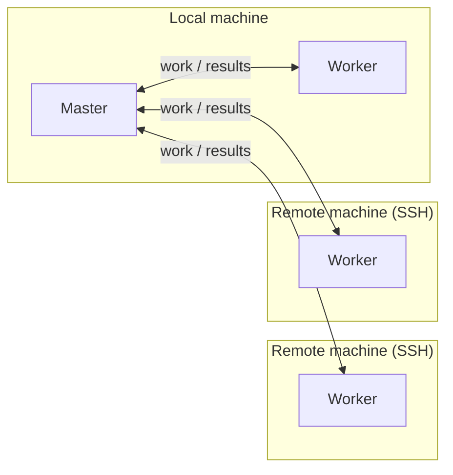

# DistSSHKit.jl

[English](README.md) · [日本語](README.ja.md)

[](https://github.com/yamanori99/DistSSHKit.jl/actions/workflows/CI.yml)
[](https://codecov.io/gh/yamanori99/DistSSHKit.jl)
[](https://github.com/yamanori99/DistSSHKit.jl/actions/workflows/jetls.yml)
[](https://github.com/yamanori99/DistSSHKit.jl/actions/workflows/ssh-e2e-daily.yml)
[](https://github.com/yamanori99/DistSSHKit.jl/actions/workflows/aqua.yml)

[](https://yamanori99.github.io/DistSSHKit.jl/stable/)
[](https://yamanori99.github.io/DistSSHKit.jl/dev/)
[](https://yamanori99.github.io/DistSSHKit.jl/stable/requirements/)

[](LICENSE)
[](https://github.com/yamanori99/DistSSHKit.jl/discussions)

DistSSHKit is a kit for running a single Julia project both locally and over SSH,
then collecting the results. By making SSH-distributed execution easier and more
standardized, it helps make your runs more reproducible. It uses Distributed.jl
processes, not threads. Supported on **macOS, Linux, and WSL2 Ubuntu** (not
native Windows).

Even small labs and individuals often have a few high-performance machines or
workstations lying around. DistSSHKit helps you put that hardware to work as a
small compute cluster.
(A lightweight scheduler built on top of this is also in progress: `DistSSHKitQueue.jl`.)

**0.3** is not getting major new features for now. The current commands stay put,
and ordinary bugs still get fixed.
[CONTRIBUTING.md](CONTRIBUTING.md#feature-freeze) ·
[Discussion #26](https://github.com/yamanori99/DistSSHKit.jl/discussions/26).

## Install

From the Julia REPL, type `]` to enter the Pkg REPL mode and run:

```julia
pkg> add DistSSHKit
```

Or, equivalently, via the `Pkg` API:

```julia
julia> import Pkg; Pkg.add("DistSSHKit")
```

The machine running the kit also needs **`ssh`**, **`rsync`**, and (only for git
deploys) **`git`** — `pkg> add` does not install them. Full requirements:
[Requirements](https://yamanori99.github.io/DistSSHKit.jl/stable/requirements/).

For everything else, see the **[Documentation](https://yamanori99.github.io/DistSSHKit.jl/stable/)**.

## Usage

### Basic terms

- **Host** — the machine that runs the work. Write `local` for your own machine,
  or `user@host` for an SSH target
  (`host` can be a `user@hostname`, an IP address, or an SSH config `Host` alias)
- **Process** — one running `julia`. Each process has its own memory and runs
  independently at the OS level
  (this kit launches multiple `julia` processes, even on a single machine, to run
  work in parallel — built on Distributed.jl)
- **Master** — the process that coordinates the whole run: it hands out work to
  workers and collects the results
- **Worker** — a process that receives work from the master and runs it

Example: one local machine plus two remote machines.



There's no limit on the number of remote hosts — more hosts just means more time
spent on SSH connections and deployment, so it's best to start with a few and
scale up from there.

Before you use a remote host, it needs to satisfy the following:

- Passwordless SSH login from your local machine
- Julia installed, with the **same major.minor version** as your local machine
  (checked by `setup --check`, more on that below)

Details: [Requirements](https://yamanori99.github.io/DistSSHKit.jl/stable/requirements/).

If SSH disconnects are a risk, use machines that stay up, and keep the master's
run alive with something like `tmux`.

### go vs drive

There are two ways to run a script:

- **go** — each host runs your standalone `.jl` file from start to finish
- **drive** — one master farms out work to workers (built on Distributed.jl)

`go` alone is plenty useful on its own. A common path is to first validate a
standalone run with `go`, then move to `drive` / Distributed.jl once you need it.

### CLI vs Julia

- **CLI** — invoke the kit directly from the terminal.
  Example: `julia -m DistSSHKit go user@host1:1 script.jl`.
  Good for quick experiments or wiring into shell scripts
- **Julia** — call the kit as functions from your own Julia code (a script, the
  REPL, or another package), using the `!`-suffixed functions such as `setup!`,
  `go!` / `drive!`.
  CLI flags map one-to-one onto these: `setup --rsync` on the CLI corresponds to
  `setup!(session, :rsync)` in Julia.
  See [`demos/with_kit/pipeline_square.jl`](demos/with_kit/pipeline_square.jl) and
  [`demos/without_kit/pipeline_pi.jl`](demos/without_kit/pipeline_pi.jl) for
  working examples

Both do the same thing under the hood — only the calling convention differs.
The CLI is the easiest place to start.

## Preparing remotes

You always need to `setup` before running a script; `setup` deploys your local
Julia project to each remote host and initializes it.

- First deploy: either `--rsync` (send the local tree as-is) or `--clone`
  (`git clone` a repository) — pick one
- Initialize: `--instantiate` (runs `Pkg.instantiate` on the remote to install
  dependencies)
- Update (redeploy): `--sync` (`git push`, then `pull` on each remote), or
  `--rsync` again
- Other modes:
  - `--check` (verify SSH / Julia / dependencies)
  - `--cleanup` (kill leftover worker processes)
  - `--delete` (remove the remote project directory — destructive)

`--rsync` / `--clone` / `--sync` / `--pull` / `--delete` all ask for confirmation
before running. Pass `-y` / `--yes` to run non-interactively, e.g. from a script.

Details: [setup](https://yamanori99.github.io/DistSSHKit.jl/stable/manual/setup/).

**Not sure whether to use rsync or git?**

- **`--rsync`** — just sends your local files as-is; no git needed on the
  remote. Good for a first try or a one-off run
- **`--clone` then `--sync`** — manages the remote as a git repository. Better
  if you're updating the code continuously, or you want `drive --require-git`
  to confirm the remote commit matches your local one for reproducibility

A typical first-time setup (rsync path) looks like this:

```bash
# Copy the files over
julia --project=. -m DistSSHKit setup --rsync user@host1 user@host2
# Initialize
julia --project=. -m DistSSHKit setup --instantiate user@host1 user@host2
# Sanity check
julia --project=. -m DistSSHKit setup --check user@host1 user@host2
```

Other commands that come in handy:

```bash
# Clean up leftover worker processes
julia --project=. -m DistSSHKit setup --cleanup user@host1 user@host2
# Start over from scratch (asks for confirmation)
julia --project=. -m DistSSHKit setup --delete user@host1 user@host2
```

## Examples

**CLI, go.** Copy the files to the remote with rsync (first time only),
initialize Julia on each machine (`--instantiate`), then run `script.jl` once
on each of `user@host1` and `user@host2`.
(Pick a single `setup` mode per invocation.)

```bash
julia --project=. -m DistSSHKit setup --rsync user@host1        # deploy files (first time only)
julia --project=. -m DistSSHKit setup --instantiate user@host1  # initialize
# Run script.jl once on each listed host (local:N also works)
julia --project=. -m DistSSHKit go user@host1:1 user@host2:1 path/to/script.jl
```

**CLI, drive.** For a git-based deploy, use `--clone` the first time and
`--sync` for later updates. Plain `rsync` (as above) works too.

```bash
julia --project=. -m DistSSHKit setup --clone user@host1        # clone the repo (first time only)
julia --project=. -m DistSSHKit setup --instantiate user@host1  # initialize
julia --project=. -m DistSSHKit drive local:2 user@host1:4 path/to/driver.jl
julia --project=. -m DistSSHKit setup --sync user@host1         # later updates
```

**Julia, go.** The same thing as the CLI example above, from Julia code.
Keep `remote=` consistent with the `setup!` call (omit both to use the default
path).

```julia
using DistSSHKit

remote = "/path/to/project"
session = KitSession(workers=["user@host1"], remote=remote, yes=true)
setup!(session, :rsync, :instantiate)                   # deploy files + initialize
go!("path/to/script.jl", "user@host1:1"; remote=remote)  # run
```

**Julia, drive.**

```julia
using DistSSHKit

remote = "/path/to/project"
session = KitSession(workers=["user@host1"], remote=remote, yes=true)
setup!(session, :clone; repo="https://github.com/org/proj.git")  # clone (first time only)
setup!(session, :instantiate)                                    # initialize
drive!("path/to/driver.jl", "local:2", "user@host1:4"; remote=remote)  # run
setup!(session, :sync)                                           # later updates
```

`pipeline!` is optional sugar: optional sync → `size!` → `drive!` → optional
collect. It does not run `setup!`; prepare remotes first.
Details: [API](https://yamanori99.github.io/DistSSHKit.jl/stable/api/).

### Try a demo

Bundled examples so you can try the kit without writing a script first:

```bash
julia --project=. -m DistSSHKit demo install with_kit
```

```bash
julia --project=. -m DistSSHKit drive local:2 demos/with_kit/square_file.jl
```

Walkthrough: [Demo](https://yamanori99.github.io/DistSSHKit.jl/stable/tutorial/demo/).

## Documentation

| | |
| --- | --- |
| Introduction | [Introduction](https://yamanori99.github.io/DistSSHKit.jl/stable/) |
| First Steps | [First Steps](https://yamanori99.github.io/DistSSHKit.jl/stable/requirements/) |
| User Guide | [User Guide](https://yamanori99.github.io/DistSSHKit.jl/stable/manual/) |
| API | [API](https://yamanori99.github.io/DistSSHKit.jl/stable/api/) |
| News | [NEWS.md](NEWS.md) |

## Contributing

Bugs and feature requests: [Issues](https://github.com/yamanori99/DistSSHKit.jl/issues).
Questions, ideas, and other chat: [Discussions](https://github.com/yamanori99/DistSSHKit.jl/discussions).
See [CONTRIBUTING.md](CONTRIBUTING.md) for how to contribute.

<!-- markdownlint-disable MD033 -->
<p align="center">
  
</p>
<!-- markdownlint-enable MD033 -->
