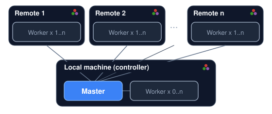

# [DistSSHKit.jl](@id DistSSHKit.jl)

DistSSHKit is a kit for running the same Julia project locally and over SSH,
then collecting the results. It makes SSH-distributed runs easier and more
uniform, which helps keep those runs reproducible. It uses Distributed.jl
processes, not threads. Supported on **macOS, Linux, and WSL2 Ubuntu** (not
native Windows).

Even small labs and individuals often have a few high-performance machines or
workstations. DistSSHKit helps you use that hardware as a small set of compute
nodes. A lightweight scheduler, `DistSSHKitQueue.jl`, is also in progress.

## What is DistSSHKit?

Two ways to run a script:

- **Same script on each machine** (`go`) — each host runs your `.jl` from start
  to finish. No rewrite needed. Prefer this when every run is already a complete
  job.
- **One machine coordinates** (`drive`) — your main Julia process stays in charge
  and hands pieces of the work to the others
  ([Distributed.jl](https://docs.julialang.org/en/v1/manual/distributed-computing/)).

Around that, the kit handles remote project setup, sync, and collecting outputs.
Use it from the terminal or from Julia code / notebooks.

How you call it is a separate choice:

- **Julia API** — `setup!` for remotes, `go!` / `drive!` to run, or
  `pipeline!` for optional sync → `size!` → `drive!` → collect (not `setup!`)
- **CLI** — `julia --project=. -m DistSSHKit go …` / `drive …`
  (and `setup`, `demo`, …)
- **`distsshkit` (experimental)** — after `pkg> app add DistSSHKit`, a
  `distsshkit` command on the terminal. Same flags as `-m`, but always the
  Apps copy, not `--project=.`. Fine for `go` / `setup` / `demo`; keep `drive`
  and `size` on `julia --project=. -m DistSSHKit`. When to use it:
  [User Guide](@ref Manual-distsshkit).

All of these need **Julia 1.12+** ([Requirements](@ref)).

Same host tokens for go / drive / size (`parent:2`, `child:user@host:1`).
`setup` uses the SSH name with no prefix. Details:
[API](@ref API), [User Guide](@ref Manual).

## Installation

From the Julia REPL, type `]` to enter the Pkg REPL mode and run:

```julia
pkg> add DistSSHKit
```

Or, equivalently, via the `Pkg` API:

```julia
julia> import Pkg; Pkg.add("DistSSHKit")
```

Optional `distsshkit` command (**1.12+**, experimental):
[User Guide](@ref Manual-distsshkit).

Also needs **`ssh`**, **`rsync`**, and **`git`** (git deploy only);
`pkg> add` does not install them. [Requirements](@ref).

## Basic terms

- **Host** — the machine that runs the work. This job's DistSSHKit parent is
  `parent`. SSH children are `child:NAME` (`user@hostname`, an IP, or an SSH
  config `Host` alias). `setup` takes that SSH name with no prefix.
- **Process** — one running `julia`. Each process has its own memory and runs
  independently at the OS level (this kit launches multiple `julia` processes,
  even on a single machine, to run work in parallel — built on Distributed.jl)
- **Master** — the process on `parent` that plans slots (`go`) or hands
  work to workers (`drive`) and collects results. `parent` is the machine
  that started that process.
- **Worker** — a process that receives work from the master and runs it

Example: when you run `go` / `drive` on your own machine, that machine is
`parent`. Each machine can run several workers (`parent` may run
none), and you can add as many remote machines as you like.

```@raw html
<p style="text-align:center">


</p>
```

The diagram is **drive**: one Master process on `parent`, workers on
`parent` and remotes. **go** uses the same `parent` token, but each
host runs independent slots (not Distributed workers).

There's no limit on the number of remote hosts — more hosts just means more
time spent on SSH connections and deployment, so it's best to start with a few
and scale up. Each remote host needs:

- Passwordless SSH from `parent`
- Julia with the same major.minor version as `parent`
  (`setup --check` verifies this)

Details: [Requirements](@ref).

## Next

Start at **[Requirements](@ref)**, then **[Prepare](@ref Tutorial-Prepare)**
(remotes) and the bundled **[Demo](@ref Tutorial-Demo)**.

Later: [`setup`](@ref Manual-setup), [`go`](@ref Manual-go),
[`drive`](@ref Manual-drive), and the rest of the
[User Guide](@ref Manual); or the **[API](@ref API)** to embed from Julia.

## Contributing

Bugs and feature requests: [Issues](https://github.com/yamanori99/DistSSHKit.jl/issues).
Questions and ideas: [Discussions](https://github.com/yamanori99/DistSSHKit.jl/discussions).
See [CONTRIBUTING.md](https://github.com/yamanori99/DistSSHKit.jl/blob/main/CONTRIBUTING.md) for how to contribute.

## License

Source code is [MIT](https://github.com/yamanori99/DistSSHKit.jl/blob/main/LICENSE).
The Julia dots in the docs logo and topology diagram are Copyright (c) 2012-2022
Stefan Karpinski, [CC BY-NC-SA 4.0](https://creativecommons.org/licenses/by-nc-sa/4.0/).
DistSSHKit adapts them.
[julia-logo-graphics](https://github.com/JuliaLang/julia-logo-graphics).
