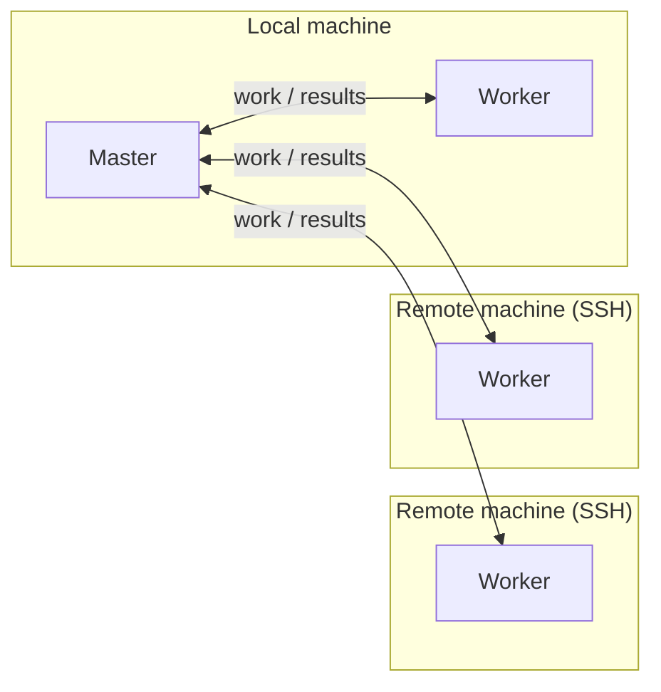

# [DistSSHKit.jl](@id DistSSHKit.jl)

DistSSHKit makes it easy to run one Julia project locally and over SSH, then
collect the results. It uses Distributed.jl processes (not threads). **macOS,
Linux, and WSL2 Ubuntu** (not native Windows).

By making SSH-distributed execution easier and more standardized, it also helps
make your runs more reproducible.

These days, even small labs and individuals often have several high-performance
machines or workstations. DistSSHKit helps you put that hardware to work.
(A lightweight scheduler built on top of this is also in progress: `DistSSHKitQueue.jl`.)

**0.3** is not getting major new features for now. The current commands stay put,
and ordinary bugs still get fixed.
[CONTRIBUTING.md](https://github.com/yamanori99/DistSSHKit.jl/blob/main/CONTRIBUTING.md#feature-freeze) ·
[Discussion #26](https://github.com/yamanori99/DistSSHKit.jl/discussions/26).

## What is DistSSHKit?

Two ways to run (job shape):

- **Same script on each machine** (`go`) — each host runs your `.jl` from start
  to finish. No rewrite needed. Prefer this when every run is already a complete
  job.
- **One machine coordinates** (`drive`) — your main Julia process stays in charge
  and hands pieces of the work to the others
  ([Distributed.jl](https://docs.julialang.org/en/v1/manual/distributed-computing/)).

Around that, the kit handles remote project setup, sync, and collecting outputs.
Use it from the terminal or from Julia code / notebooks.

How you call it is a separate choice:

- **Julia API** (**1.12+**) — `setup!` for remotes, `go!` / `drive!` to run, or
  `pipeline!` for optional sync → size! → drive! → collect (not `setup!`)
- **CLI** (**1.12+**) — `julia --project=. -m DistSSHKit go …` / `drive …`
  (and `setup`, `demo`, …). This is the job-project kit.
- **`distsshkit` (experimental, 1.12+)** — after `pkg> app add DistSSHKit`, a
  `distsshkit` command on the terminal. Same flags as `-m`, but always the
  Apps copy, not `--project=.`. When to use it:
  [User Guide](@ref Manual-distsshkit).

Same host tokens for all of these (`local:2`, `user@host:1`). Details:
[API](@ref API), [User Guide](@ref Manual).

## Installation

From the Julia REPL, type `]` to enter the Pkg REPL mode and run:

```julia
pkg> add DistSSHKit
```

Or, equivalently, via the `Pkg` API:

```julia
julia> import Pkg; Pkg.add("DistSSHKit")
```

Optional `distsshkit` command (**1.12+**, experimental):
[User Guide](@ref Manual-distsshkit).

Also needs **`ssh`**, **`rsync`**, and **`git`** (git deploy only);
`pkg> add` does not install them. [Requirements](@ref).

## Basic terms

- **Host** — the machine that runs the work. Write `local` for your own machine,
  or `user@host` for an SSH target (`host` can be a `user@hostname`, an IP
  address, or an SSH config `Host` alias)
- **Process** — one running `julia`. Each process has its own memory and runs
  independently at the OS level (this kit launches multiple `julia` processes,
  even on a single machine, to run work in parallel — built on Distributed.jl)
- **Master** — the process that coordinates the whole run: it hands out work to
  workers and collects the results
- **Worker** — a process that receives work from the master and runs it

Example: one local machine plus two remote machines.



There's no limit on the number of remote hosts — more hosts just means more
time spent on SSH connections and deployment, so it's best to start with a few
and scale up. Each remote host needs passwordless SSH from your local machine
and Julia with the same major.minor version (`setup --check` verifies this).
Details: [Requirements](@ref).

## Next

Start at **[Requirements](@ref)**, then **[Prepare](@ref Tutorial-Prepare)**
(remotes) and the bundled **[Demo](@ref Tutorial-Demo)**.

Later: [`setup`](@ref Manual-setup), [`go`](@ref Manual-go),
[`drive`](@ref Manual-drive), and the rest of the
[User Guide](@ref Manual); or the **[API](@ref API)** to embed from Julia.

## Contributing

Bugs and features to track: [Issues](https://github.com/yamanori99/DistSSHKit.jl/issues).
Questions, ideas, and other chat: [Discussions](https://github.com/yamanori99/DistSSHKit.jl/discussions).
See [CONTRIBUTING.md](https://github.com/yamanori99/DistSSHKit.jl/blob/main/CONTRIBUTING.md) for how to contribute.
