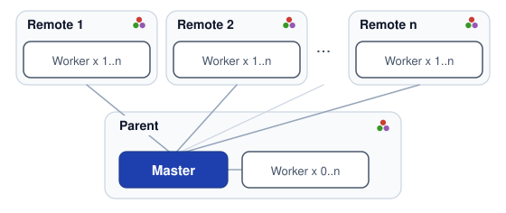
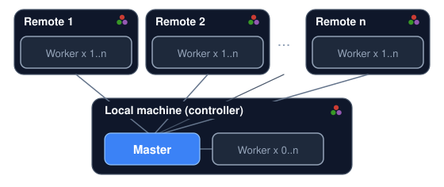

# [DistSSHKit.jl](@id DistSSHKit.jl)

DistSSHKit is a toolkit for running Julia computations across multiple
machines over SSH. It works equally well for a pair of workstations and
for a larger set of lab machines.
Supported on **macOS, Linux, and WSL2 Ubuntu** (not native Windows).

`pkg> add DistSSHKit` is all you need to install it. The command is
`julia -m DistSSHKit`. DistSSHKit bundles DistSSHRun and DistSSHQueue.
You do not install them separately.

A job runs in one of two places.

- **This machine.** Start it here. The SSH connection stays open until
  it finishes.
- **Queue host.** An always-on machine. Leave the job there. Jobs run
  one at a time. A dropped laptop does not stop a job already left there.
  `qhost` names that machine.

**Prepare hosts** is shared by both. [`setup`](@ref Manual-setup) prepares
SSH hosts. [`up`](@ref Manual-up) puts the same Julia channel on each
machine. Do that before you start.

## What is DistSSHKit?

On this machine, three ways to run a script:

- **Same script on each machine** (`go`) — each host runs your `.jl` end to
  end. Prefer when every run is already a complete job.
- **Split map / filter** (`ride`) — experimental split of `map`, `filter`,
  and simple comprehensions.
- **One machine coordinates** (`drive`) — the main process farms work to
  the others ([Distributed.jl][dist-jl]).

Match Julia versions with [`up`](@ref Manual-up) before you start. Remote
project setup, sync, and collecting outputs are the same from the terminal
or from Julia / notebooks.

Call paths:

- **Julia API** — `setup!` for remotes, `go!` / `drive!` to run, or
  `pipeline!` for optional sync → `drive!` → collect (not `setup!`;
  rsync there does not instantiate). Occupancy is CLI `size` and
  Julia `size!`; paste the printed tokens.
- **CLI** — `julia --project=. -m DistSSHKit go …` / `ride …` / `drive …` /
  `plan …` (and `setup`, `demo`, …)

All of these need **Julia 1.13+** ([Requirements](@ref)).

Same host tokens for setup / go / drive / ride / size / pool (`parent:2`,
`child:user@host:1`; setup / size / pool ignore `:N`). Details:
[API](@ref API), [User Guide](@ref Manual).

## Installation

From the Julia REPL, type `]` to enter the Pkg REPL mode and run:

```julia
pkg> add DistSSHKit
```

Or: `import Pkg; Pkg.add("DistSSHKit")`.

Also needs **`ssh`**, **`rsync`**, and **`git`** (git deploy only);
`pkg> add` does not install them. [Requirements](@ref).

## Basic terms

- **Host** — a machine, given as a token like `parent` or
  `child:user@hostname`.
- **Process** — one `julia` OS process with its own memory. A run may
  start several per host (Distributed.jl).
- **The machine the run starts from** — this machine when you run `go` /
  `drive` here, and the queue host when the job was left there.
- **Master** — the process on the machine the run starts from. It plans
  slots (`go`) or farms work to workers (`drive`) and collects results.
- **Worker** — a process that receives work from the master and runs it.

Example: running `go` / `drive` on your machine makes that machine the one
the job started from. Each host can run several workers (including zero
on this machine).
Remotes are optional.

```@raw html
<p style="text-align:center">


</p>
```

The diagram is **drive**. One master on the machine the run starts from,
workers on each host.
**go** uses the same host tokens, but there is no
master/worker: each host runs the script on its own.

```text
parent                 # this machine
parent:2               # two on this machine
child:user@hostname    # SSH child (user@host, IP, or Host alias)
child:user@hostname:4  # four on that child
```

No hard limit on SSH hosts; more remotes means more SSH and deploy time —
start with a few. Each SSH host needs:

- Passwordless SSH from the machine the run starts from
- Julia with the same major.minor version as that machine
  (`setup --check` verifies this). Match the channel with
  [`up`](@ref Manual-up) first.

Details: [Requirements](@ref).

## Next

Start at **[Requirements](@ref)**.

On this machine: **[Prepare](@ref Tutorial-Prepare)** and the bundled
**[Demo](@ref Tutorial-Demo)**, then [`setup`](@ref Manual-setup),
[`go`](@ref Manual-go), [`ride`](@ref Manual-ride), and
[`drive`](@ref Manual-drive).

On a queue host: **[Prepare the machine](@ref Queue-Tutorial-Prepare)**,
then **[First job](@ref Queue-Tutorial-Client)**.

Or the **[API](@ref API)** to embed from Julia. The rest of the
[User Guide](@ref Manual) lists every command.

## Contributing

Bugs and feature requests:
[Issues](https://github.com/yamanori99/DistSSHKit.jl/issues).
Questions and ideas:
[Discussions](https://github.com/yamanori99/DistSSHKit.jl/discussions).
See [CONTRIBUTING.md][contrib] for how to contribute.

## License

Source code is [MIT][mit-lic].
The Julia dots in the docs logo and topology diagram are Copyright (c)
2012-2022 Stefan Karpinski,
[CC BY-NC-SA 4.0](https://creativecommons.org/licenses/by-nc-sa/4.0/).
DistSSHKit adapts them.
[julia-logo-graphics](https://github.com/JuliaLang/julia-logo-graphics).

[contrib]: https://github.com/yamanori99/DistSSHKit.jl/blob/main/CONTRIBUTING.md
[mit-lic]: https://github.com/yamanori99/DistSSHKit.jl/blob/main/LICENSE
[dist-jl]: https://docs.julialang.org/en/v1/manual/distributed-computing/
